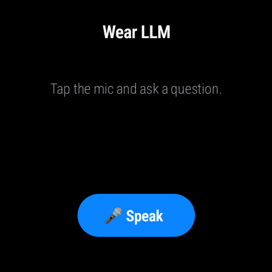
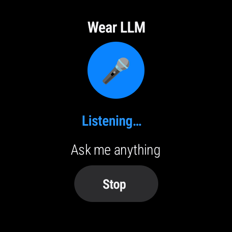
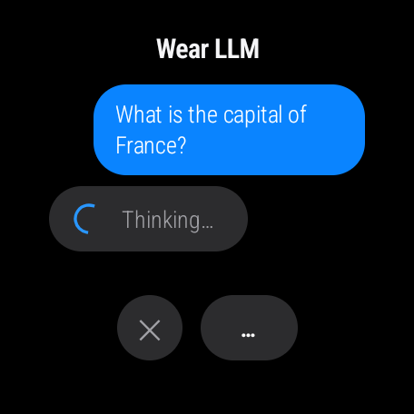
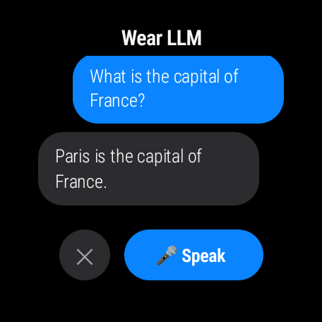

# Wear LLM — an on-watch local LLM voice assistant

A React Native app for **Wear OS** that runs a **real LLM entirely on the watch** and is
driven by voice. Nothing leaves the device — no phone, no laptop, no cloud.

Verified working on a **Google Pixel Watch 3** (Wear OS, Android 14).

| Question (spoken/typed on the watch) | On-watch answer |
|---|---|
| "What is the capital of Japan" | "The capital of Japan is Tokyo." |
| "What is the tallest mountain on Earth?" | "…Mount Everest, at ~8,848.85 meters." |

## Screenshots

<table>
  <tr>
    <td align="center"><br><sub><b>Ready</b></sub></td>
    <td align="center"><br><sub><b>Voice input</b></sub></td>
    <td align="center"><br><sub><b>Thinking…</b></sub></td>
    <td align="center"><br><sub><b>On-watch answer</b></sub></td>
  </tr>
</table>

<sub>Every screenshot is from a Pixel Watch 3 — the LLM runs on the watch itself, no phone or cloud. Answered by SmolLM2-360M on-device.</sub>

## How it works

The Pixel Watch 3 runs a **fully 32-bit userspace** (`armeabi-v7a` only, ~0.5 GB free RAM).
Every mainstream on-device LLM library for React Native (llama.rn, ExecuTorch, MLC,
MediaPipe) is **arm64-only** and won't build for it. So instead:

1. **`llama.cpp` is cross-compiled for `armeabi-v7a`** as a small static HTTP server
   (`llama-server`) and shipped inside the APK as `jniLibs/armeabi-v7a/libllamaserver.so`.
   The one thing that blocks a 32-bit build — an optional FP16 NEON kernel that uses
   ARMv8-only intrinsics — is turned off with `-DGGML_LLAMAFILE=OFF`. See
   [`native/build-llama-server.sh`](native/build-llama-server.sh).
2. On launch, a **native module** (`LlamaServerModule.kt`) execs that binary (extracted to
   the app's `nativeLibraryDir`) so it listens on `127.0.0.1:8080` **on the watch**.
3. **Voice** uses the system Wear dictation UI via the `ACTION_RECOGNIZE_SPEECH` intent
   (`SpeechModule.kt`) — the most reliable path on Wear OS (this watch has no bindable
   `RecognitionService`, so the in-app `SpeechRecognizer` API isn't available), and it needs
   no `RECORD_AUDIO` permission in our app. It **auto-submits when you stop talking**.
4. The **RN UI** (`App.tsx`) sends the transcript to the local server and streams the
   answer back token-by-token over plain HTTP, then **speaks it aloud** through the watch
   speaker via the system Text-To-Speech engine (`TtsModule.kt`).

**Model:** [SmolLM2-360M-Instruct](https://huggingface.co/bartowski/SmolLM2-360M-Instruct-GGUF)
(Q4_K_M, ~260 MB, Apache-2.0). It's tiny, so expect short, simple answers and the occasional
mistake. Throughput on the watch is ~1–4 tokens/sec depending on thermal state (the first
answer after launch is slower while the model pages in from storage).

## Toolchain

Bleeding-edge as of Aug 2026 — all confirmed building & running:

| | Version |
|---|---|
| React Native | 0.87.0 (New Architecture + Hermes) |
| Gradle / AGP / Kotlin | 9.4.1 / 9.2.x / 2.2.0 |
| **JDK** | **21** (Android Studio's JBR) — AGP does **not** support JDK 25 |
| NDK | 27.1.12297006 |
| compileSdk / target / min | 36 / 36 / 24 (SDK Platform 37 isn't published yet; 36 builds fine) |
| ABI | `armeabi-v7a` only |

## Build & run

```bash
# one-shot: build the standalone release APK, install, provision model, launch
./scripts/build-and-run.sh
```

Or step by step:

```bash
# 1. (once) rebuild the on-device server binary — only if you change llama.cpp
./native/build-llama-server.sh

# 2. build + install the standalone app (JS bundled in; no Metro needed)
export JAVA_HOME=/home/mk/android-studio/jbr
export ANDROID_HOME=/home/mk/Android/Sdk
cd android && ./gradlew :app:assembleRelease
adb install -r app/build/outputs/apk/release/app-release.apk

# 3. put the model on the watch (once; persists across reboots/updates)
./scripts/provision-model.sh SmolLM2-360M-Instruct-Q4_K_M.gguf

# 4. launch, then tap "Speak" on the watch and ask a question
```

For UI iteration you can also run a debug build with Metro over USB:
`adb reverse tcp:8081 tcp:8081 && npx react-native start`, then `assembleDebug`/install.

## Notes & gotchas

- **The model is not in the APK** (it's ~260 MB). `provision-model.sh` pushes it to the app's
  external files dir. To make a truly one-tap install, bundle it in
  `android/app/src/main/assets/` and copy to `filesDir` on first launch (bigger APK).
- **Cleartext to localhost:** release builds disable cleartext HTTP; `res/xml/network_security_config.xml`
  re-enables it **only** for `127.0.0.1`/`localhost` so the app can reach its own server.
- **Voice needs a correct system clock.** If the watch's date is wrong, TLS fails
  (`ERR_CERT_DATE_INVALID`) and the network speech recognizer won't initialize. Fix it on the
  watch (Settings → System → Date & time → automatic) or by pairing to a phone.
- The on-device server survives the app being force-stopped; the module **reuses** a running
  server on relaunch instead of spawning a second one.

## Layout

- `App.tsx` — the watch UI (round-screen layout, streaming chat).
- `android/app/src/main/java/com/wearllmapp/LlamaServerModule.kt` — spawns/monitors the on-device server.
- `android/app/src/main/java/com/wearllmapp/SpeechModule.kt` — system voice-input intent.
- `android/app/src/main/jniLibs/armeabi-v7a/libllamaserver.so` — the 32-bit llama.cpp server.
- `native/build-llama-server.sh` — reproduces that binary.
- `scripts/` — provision the model, build-and-run helpers.

## License

MIT — see [LICENSE](LICENSE). Bundled components keep their own licenses:
[llama.cpp](https://github.com/ggml-org/llama.cpp) (MIT) and the
[SmolLM2-360M-Instruct](https://huggingface.co/HuggingFaceTB/SmolLM2-360M-Instruct)
model (Apache-2.0).
